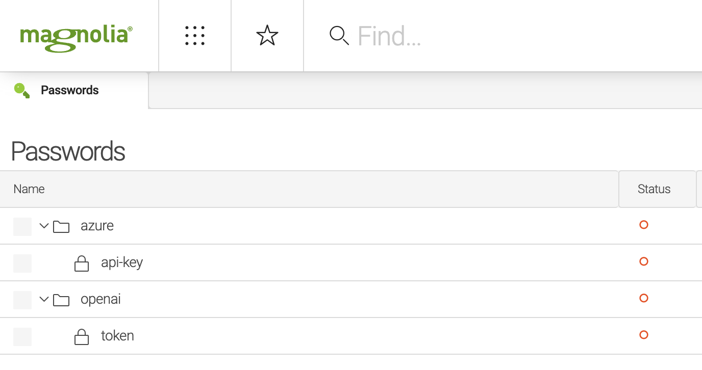
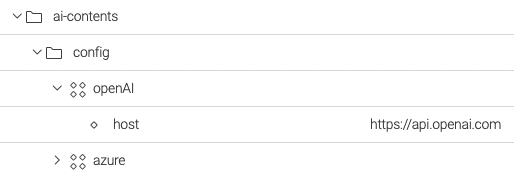
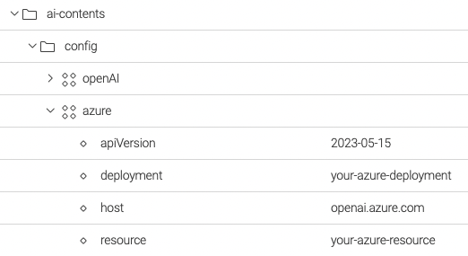
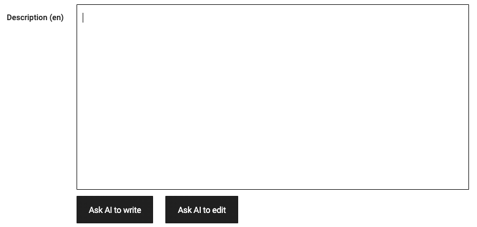
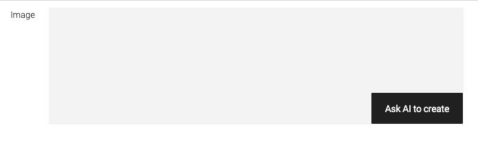

# Magnolia AI Contents

This module of [Magnolia CMS](https://www.magnolia-cms.com/) provides a set of features for [prompt engineers](https://en.wikipedia.org/wiki/Prompt_engineering) to create contents using [Large language models](https://en.wikipedia.org/wiki/Large_language_model) like [GPT](https://en.wikipedia.org/wiki/GPT-3) from [Open AI](https://openai.com/).

## Features
- Integration with the API of [OpenAI](https://platform.openai.com/docs/api-reference) and [Azure OpenAI](https://azure.microsoft.com/products/cognitive-services/openai-service/)
- UI field `textFieldAI` to create and edit text contents using AI.
- Prompt generator to create prompts from existing contents.
- UI field `imageAI` to create images using AI.

## Setup
1. Add maven dependency with the module **ai-contents**
```xml
<dependencies>
    <dependency>
        <groupId>org.formentor</groupId>
        <artifactId>ai-contents</artifactId>
        <version>${ai-contents.version}</version>
    </dependency>
</dependencies>
```
2. Set the _token_ of [OpenAI](https://openai.com/) or _api-key_ of [Azure OpenAI](https://azure.microsoft.com/products/cognitive-services/openai-service/) in [passwords manager](https://docs.magnolia-cms.com/product-docs/6.2/Modules/List-of-modules/Password-Manager-module.html).  
In case of using [passwords manager](https://docs.magnolia-cms.com/>product-docs/6.2/Modules/List-of-modules/Password-Manager-module.html), the OpenAI token must be stored in the path `/openai/token` and Azure api-key in `/azure/api-key`

It is possible to specify the _token_ and _api-key_ using the environment variables `OPENAI_TOKEN` or `AZURE_API_KEY`
```bash
export OPENAI_TOKEN=sk-...84jf
export AZURE_API_KEY=97...xaa
```
> Remenber that you have to configure just [OpenAI](https://openai.com/) or [Azure OpenAI](https://azure.microsoft.com/products/cognitive-services/openai-service/).
3. Configure the module in Magnolia

Configuration for [Open AI](https://openai.com/)



Configuration for [Azure OpenAI](https://azure.microsoft.com/products/cognitive-services/openai-service/)



## Usage
### Field _textFieldAI_
Creates text content from a given prompt and edits text for given instructions.



Definition of field _textFieldAI_

```yaml
textFieldUsingAI:
  $type: textFieldAI
  rows: 12
  words: 300
  performance: high
  strategy: completion
  promptGenerator:
    template: products-app.ai.prompt.template.description
    properties:
      name:
        name: name
      description:
        name: description
      tourTypes:
        targetWorkspace: category
        targetPropertyName: displayName
```
### Field properties
#### words
Specifies the number of words of the text created using AI.
#### performance
Indicates the performance of the prediction model. Allowed values:
- **best** 
- **high**
- **medium**
- **low**

#### strategy
Specifies the completion strategy to add text content using OpenAI. Allowed values:
- `completion` to write the text from a given prompt.
- `edit` to edit the current text from instructions -e.g. "Translate the following from slang to a business letter" -.
 
#### promptGenerator
Specifies the form properties and template used to generate a prompt for completion.

- _properties_ as the list of properties in the form whose value will appear in the prompt. In case of `link fields`, specify the target `workspace` and `property` in target workspace.
- _template_ specifies the message or copy with the prompt template.
> products-app.ai.prompt.template.description=Write a product description based on the information provided in the technical specifications delimited by triple backticks.\n\nUse {1} as language.\n\nTechnical specifications: ```{0}```

Use {0} to insert the value of the properties and {1} for the language 

### Field _imageAI_
Creates image content from a given prompt.



Definition of field _imageAI_

```yaml
imageAI:
  $type: imageAI
```
### Example
```yaml
subApps:
  detail:
    label: Blog
    form:
      properties:
        imageAI:
          $type: compositeField
          label: Image AI
          itemProvider:
            $type: jcrChildNodeProvider
            nodeName: jcr:content
            nodeType: mgnl:resource
          properties:
            image:
              label: ""
              $type: imageAI
```