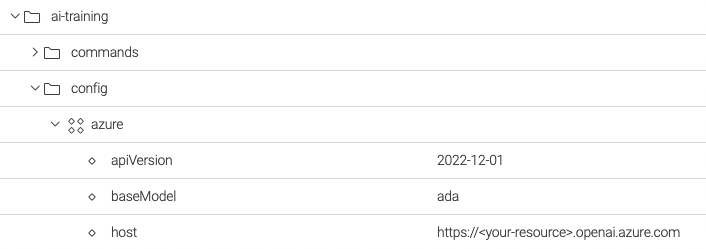

# Magnolia AI Training

This module of [Magnolia CMS](https://www.magnolia-cms.com/) provides the generation of [Large language models](https://en.wikipedia.org/wiki/Large_language_model) like [GPT](https://en.wikipedia.org/wiki/GPT-3) using as input dataset contents in [Magnolia CMS](https://www.magnolia-cms.com/).

## Features
- Integration with the API of [OpenAI](https://platform.openai.com/docs/api-reference) and [Azure OpenAI](https://azure.microsoft.com/products/cognitive-services/openai-service/)
- Creation of fine-tuned models in [Open AI GPT](https://openai.com/blog/gpt-3-apps) and [Azure OpenAI](https://azure.microsoft.com/products/cognitive-services/openai-service/)

## Setup
1. Add dependency with the module **ai-contents**
```xml
<dependencies>
    <dependency>
        <groupId>org.formentor</groupId>
        <artifactId>ai-training</artifactId>
        <version>${ai-contents.version}</version>
    </dependency>
</dependencies>
```
2. Set the environment variable _OPENAI_TOKEN_ or _AZURE_API_KEY_ with the _secret key_ of [Open AI](https://openai.com/) or _api-key_ of [Azure OpenAI](https://azure.microsoft.com/products/cognitive-services/openai-service/) depending on the implementation.

```bash
export OPENAI_TOKEN=sk-...84jf
export AZURE_API_KEY=97...xaa
```

3. Configure the module in Magnolia
   Configuration for [Open AI](https://openai.com/)


Configuration for [Azure OpenAI](https://azure.microsoft.com/products/cognitive-services/openai-service/)



## Usage
The module _ai-training_ provides the command `ModelTrainerCommand` to create fine-tuned models

Input parameters of `ModelTrainerCommand`
- **modelName** to specify the prefix of the fine-tuned model created in [Open AI GPT-3](https://openai.com/blog/gpt-3-apps) or [Azure OpenAI](https://azure.microsoft.com/products/cognitive-services/openai-service/).
- **workspace** to specify the workspace of the text contents used to build the training data.
- **root** to specify the root path of the nodes to be used to build the examples of the training data.
- **nodeType** to specify of the nodes to be used to build the examples of the training data.
- **propertiesAsPrompt** to specify the node properties used to build the *prompt* in examples of the training data.
In case of `linked fields` specify the `target worspace` and `target property` 
- **propertyAsCompletion** as the origin property for the value of *completion* in examples of the training data. 

### Example
```groovy
cm = info.magnolia.commands.CommandsManager.getInstance()
command = cm.getCommand('ai','ModelTrainerCommand')

propertyPromptTourTypes = new org.formentor.magnolia.ai.training.domain.PropertyPromptValue()
propertyPromptTourTypes.setPropertyName('tourTypes')
reference = new org.formentor.magnolia.ai.training.domain.PropertyPromptValue.Reference()
reference.setTargetWorkspace("category")
reference.setTargetPropertyName("displayName")
propertyPromptTourTypes.setReference(reference)

propertyPromptLocation = new org.formentor.magnolia.ai.training.domain.PropertyPromptValue()
propertyPromptLocation.setPropertyName('location')

command.setModelName('magnolia-tours')
command.setWorkspace('tours')
command.setRoot('/magnolia-travels')
command.setNodeType('mgnl:content')
command.setPropertiesAsPrompt([propertyPromptTourTypes, propertyPromptLocation])
command.setPropertyAsCompletion(['body'])

command.execute(new info.magnolia.context.SimpleContext())
```